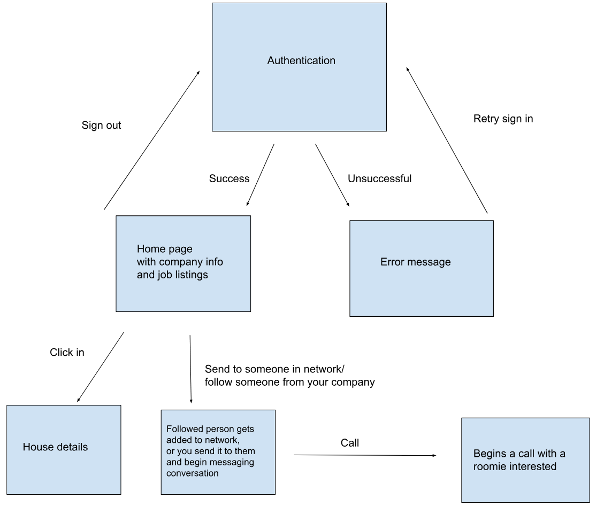

Find Housing – Fullstack MVP

Stack
- Client: React + TypeScript (Vite) in `client/`
- API: Express + PostgreSQL in `server/`
- DB: Postgres 16 via Docker Compose

Prerequisites
- Node.js 18+ (20+ recommended)
- Docker Desktop (or a local Postgres 16)

1) Start PostgreSQL
- From repo root:
  - `docker compose up -d`
- This starts Postgres at `localhost:5432` with database `find_housing` and user/password `postgres/postgres`.

2) API: install, seed, run
- `cd server`
- `cp .env.example .env` (edit if needed)
- `npm i`
- Initialize schema + seed sample data:
  - `npm run seed`
- Run the API (dev):
  - `npm run dev`
- API default URL: `http://localhost:4000`

Endpoints (MVP)
- `GET /health` → `{ ok: true }`
- `POST /admin/init` → idempotent schema init
- `GET /companies` → companies list
- `GET /areas` → areas list
- `GET /listings` → listings (shape matches client Listing)
- `POST /listings` → create listing
- `POST /users` → create user (name, age, gender, employer, passcode)
- `GET /admin/summary` → counts + latest listings
- `GET /status` → server status page
- `POST /login` → login form information is compared
- `POST /signup` → db entry is created and is checked from the login post info

3) Client: install and run
- In a new terminal:
  - `cd client`
  - `npm i`
  - Create `.env.local` with API URL:
    - `echo 'VITE_API_URL=http://localhost:4000' > .env.local`
  - `npm run dev`
- Open the URL Vite prints (e.g., `http://localhost:5173`).

Client features (MVP)
- Minimal signup/login (stored in localStorage: name, age, gender, employer, passcode)
- Listings grid with sort/filter (city, price range, beds; sort by price/beds/availability)
- Favorites saved locally
- If `VITE_API_URL` is set and API is running, listings/users use the API; otherwise it falls back to local mock data.

Optional: pgAdmin dashboard
- If you run pgAdmin in Docker (e.g., mapped to `5050:80`):
  - Open `http://localhost:5050` and sign in with the credentials you set for the container
  - Register your server:
    - Host: `host.docker.internal`
    - Port: `5432`
    - Username: `postgres`
    - Password: `postgres`
    - Maintenance DB: `postgres`
- If pgAdmin runs in the same compose network as Postgres, you can use Host: `db` instead.

Troubleshooting
- API says “relation ... does not exist”: run `npm run seed` in `server/`.
- Client fails to fetch listings: confirm `VITE_API_URL` is set and API is running.
- pgAdmin “Name does not resolve”: use `host.docker.internal` for Host, not `localhost` from the container.
- Reset pgAdmin admin login: remove its data volume and recreate the container with the desired env vars.

Notes
- This MVP intentionally skips real authentication and encryption; passcodes are stored in plain text.
- Data model includes Companies, Users (name/age/gender/employer), Areas, Listings, and Preferences for future matching.

**Layered Architecture Deliverable**

Priorities
| Rank | Priority                                  | Description                                                      |
| ---- | ----------------------------------------- | ---------------------------------------------------------------- |
| 1    | **Software Reuse**                        | Maximize reuse of components for scalability and maintainability |
| 2    | **Software Compatibility**                | Ensure compatibility across browser platforms                    |
| 3    | **Nonfunctional Product Characteristics** | Focus on security, performance, and reliability                  |
| 4    | **Product Lifetime**                      | Long-term maintainability and support                            |
| 5    | **Number of Users**                       | Scalable to accommodate a growing user base                      |

Layer Architecture
| Layer                                  | Included | Description                                   |
| -------------------------------------- | -------- | --------------------------------------------- |
| **Browser-based / Mobile UI**          | Yes        | User interface for interactions               |
| **Authentication & User Management**   | Yes        | Login, sign-up, and access control            |
| **Application-Specific Functionality** | No        | Not included in this phase                    |
| **Shared Services**                    | Yes        | Common infrastructure (e.g., search, storage) |
| **Transaction Database Management**    | Yes        | Handles persistent data transactions          |

Components and Services
| Component                          | Description                                       |
| ---------------------------------- | ------------------------------------------------- |
| **UI**                             | Web browser-based interface                       |
| **UI Management**                  | Handles authentication (login/logout)             |
| **Configuration Services**         | N/A                                               |
| **Application Services**           | Email, messaging, and calling features            |
| **Integrated Services**            | N/A                                               |
| **Shared Infrastructure Services** | Authentication, User Storage, App Storage, Search |

System Design & Flow

Pros/Cons
| Category              | Technology           |
| --------------------- | -------------------- |
| **Database**          | PostgreSQL (Neon)    |
| **Platform**          | Web                  |
| **Server**            | React + Express      |
| **Open Source**       | N/A                  |
| **Development Tools** | Docker, Vite, Vercel |
